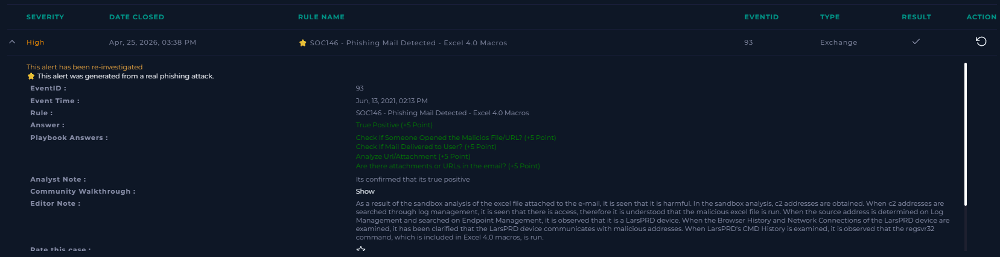
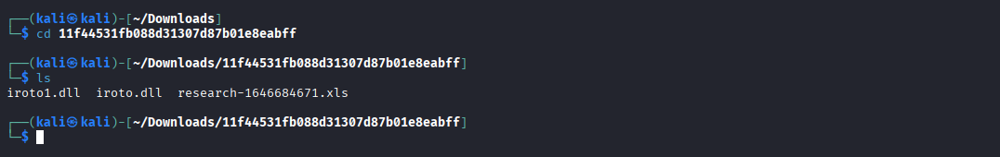
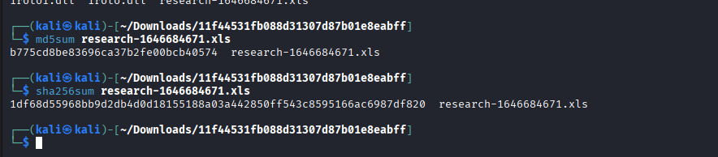
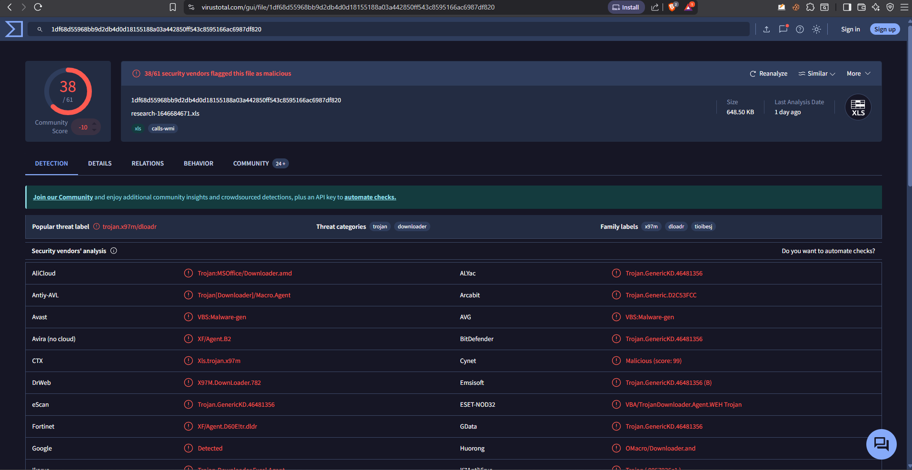
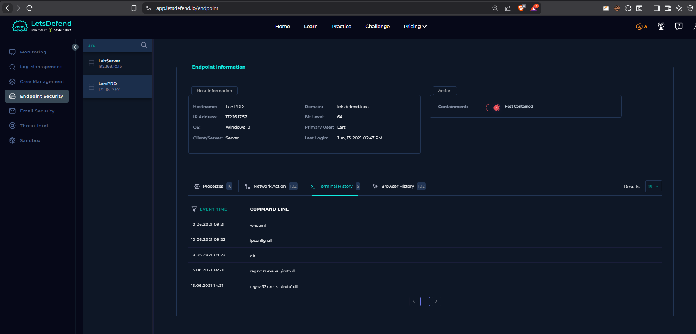

# 🚨 Phishing Email Analysis – Excel 4.0 Macro Malware (SOC146)

---

## 🧠 Overview
This report analyzes a phishing email delivering a malicious Excel attachment using Excel 4.0 (XLM) macros. The objective is to identify indicators of compromise (IOCs), analyze the attachment, and confirm whether the attack resulted in execution on the endpoint.

---
## 📊 Alert Validation

> 📸 Insert screenshot:
> - Alert showing rule name and severity

### 🔍 Details
- **Rule Name:** SOC146 – Phishing Mail Detected (Excel 4.0 Macros)  
- **Severity:** High  
- **Result:** True Positive  

This confirms that the alert generated by the security system corresponds to a real phishing attack.

---
## 📧 Email Analysis

> - Email showing sender, subject, message, and attachment

- **Sender:** trenton@tritowncomputers.com  
- **Recipient:** lars@letsdefend.io  
- **Subject:** RE: Meeting Notes  
- **Date:** June 13, 2021  

### 🚩 Suspicious Indicators
- “RE:” subject without prior conversation  
- Generic and vague message content  
- Encourages opening an attachment  
- Password-protected file (used to evade scanning)  
- File type inconsistent with expected “meeting notes”  

---

## 📂 File Extraction & Inspection

> 📸 Insert screenshot:
> - Terminal showing extracted files (`.xls`, `.dll`)

### 🔍 Observations
- Extracted files:
  - `research-1646684671.xls`  
  - `iroto.dll`  
  - `iroto1.dll`  
- Presence of DLL files suggests additional payload components

---

## 📎 Attachment Analysis

- **Filename:** research-1646684671.xls  
- **Type:** Excel 97-2003 Worksheet  
- **Technique:** Excel 4.0 Macros  

The document uses social engineering (fake secure document message) to trick users into enabling malicious functionality.

---

## 🔑 File Hash Generation

- **MD5:** b775cd8be83696ca37b2fe00bcb40574  
- **SHA256:** 1df68d55968bb9d2db4d0d18155188a03a442850ff543c8595166ac6987df820  

Hashes uniquely identify the file and were used for threat intelligence lookup.

---

## 🔍 Threat Intelligence (VirusTotal)

> - VirusTotal detection page (38/61)

- **38/61 vendors detected the file as malicious**

### 🧠 Interpretation
- Classified as **Trojan Downloader**
- Designed to download additional malicious payloads

This aligns with the presence of external URLs and DLL payloads identified during analysis.

---

## 🔗 Indicators of Compromise (IOCs)

### 🌐 Suspected Domains (from static analysis)
- nws.visionconsulting.ro  
- royalpalm.sparkblue.lk  

### 📦 Files
- iroto.dll  
- iroto1.dll  

### 🔑 Hash
- SHA256: 1df68d55968bb9d2db4d0d18155188a03a442850ff543c8595166ac6987df820  

> Note: Domains were identified through static analysis. No direct network connection was confirmed in logs.

---

## 🖥️ Endpoint Analysis

> 📸 Insert screenshot:
> - Endpoint Security page

### 🔍 Observations
- **Hostname:** LarsPRD  
- **OS:** Windows 10  
- **User:** Lars  

---

## ⌨️ Command Execution Evidence

> 📸 Insert screenshot:
> - Terminal History showing regsvr32 execution

### 🚨 Suspicious Commands
- `regsvr32.exe -s ./iroto.dll`
- `regsvr32.exe -s ./iroto1.dll`

### 🧠 Analysis
- `regsvr32` is a legitimate Windows binary (LOLBIN)
- Commonly abused to execute malicious DLLs
- Confirms successful execution of malware

---

## 🧠 Attack Chain

1. User receives phishing email  
2. Email contains malicious Excel attachment  
3. User opens the file  
4. Social engineering message tricks user  
5. Excel 4.0 macro executes  
6. regsvr32 loads malicious DLL  
7. System connects to attacker-controlled infrastructure  
8. Additional malware is downloaded  

---

## ⚠️ Conclusion

This is a phishing-based malware attack leveraging Excel 4.0 macros and social engineering techniques.

The file acts as a **Trojan Downloader**, executing malicious DLL payloads using `regsvr32`.

Endpoint logs confirm that the malicious file was executed, indicating **successful compromise of the system**.

---

## 🚀 Skills Demonstrated

- Email Phishing Analysis  
- Static Malware Analysis  
- File Hashing & Identification  
- Threat Intelligence (VirusTotal)  
- IOC Extraction  
- Endpoint Log Analysis  
- SOC Investigation Workflow  

---
